# SQRL SSP - TOGAF Architecture Documentation
**Framework:** The Open Group Architecture Framework (TOGAF)
**Version:** 9.2
**Project:** SQRL Server-Side Protocol Implementation
**Date:** November 18, 2025

---

## Executive Summary

This document provides a TOGAF-aligned architecture view of the SQRL SSP (Secure QR Login Server-Side Protocol) implementation, mapping business objectives to functional requirements and technical architecture.

---

## TOGAF Architecture Development Method (ADM) Phases

### Phase A: Architecture Vision

#### Business Objectives

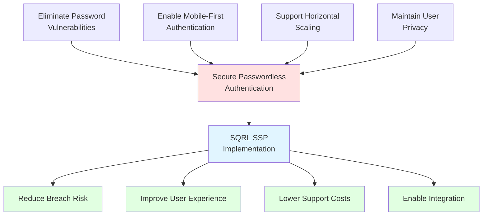

#### Key Stakeholders

| Stakeholder | Concern | Requirement |
|------------|---------|-------------|
| **End Users** | Easy authentication without passwords | QR code scanning, mobile-first |
| **Security Team** | Strong authentication without credential storage | ED25519 cryptography, no password storage |
| **Operations Team** | Scalable, reliable deployment | Horizontal scaling, monitoring |
| **Developers** | Easy integration with existing systems | Pluggable interfaces, clear API |
| **Compliance** | GDPR, security standards | Privacy-preserving, audit trails |

---

## TOGAF Business Architecture

### Business Capability Map

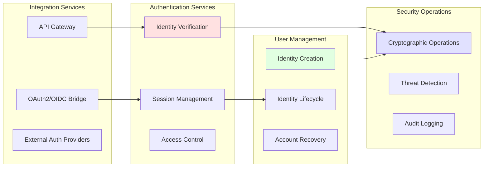

### Business Process: User Authentication

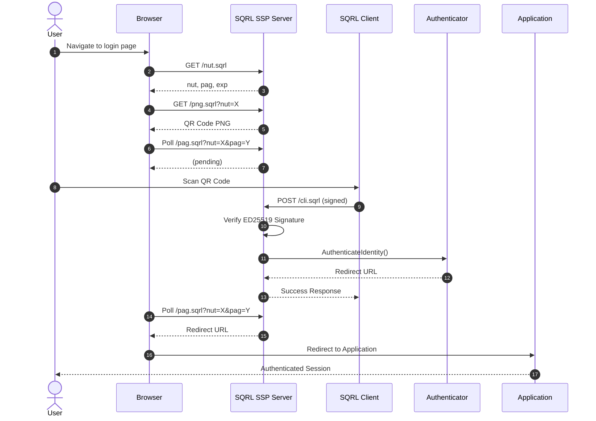

---

## TOGAF Application Architecture

### Application Component Model

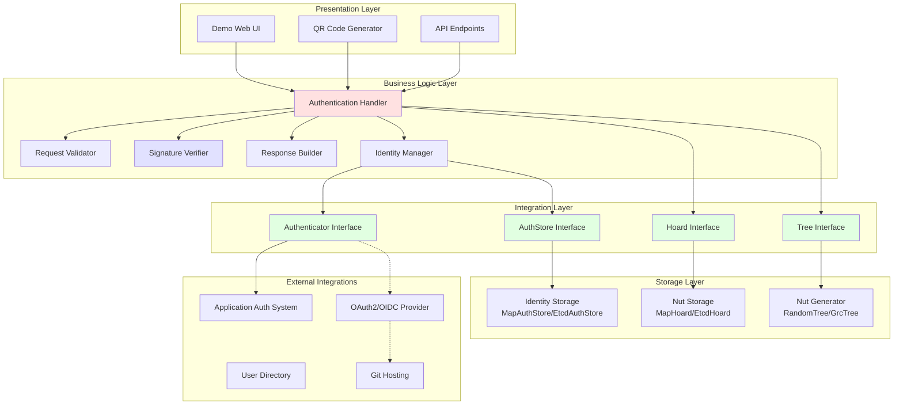

### Application Interaction Model

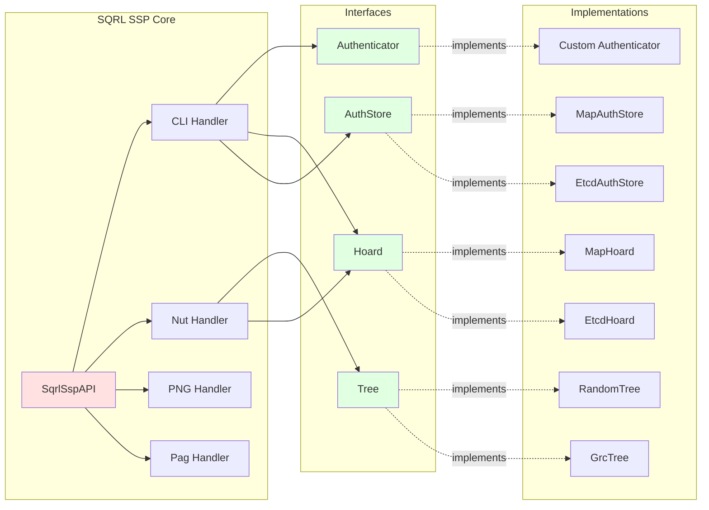

---

## TOGAF Data Architecture

### Conceptual Data Model

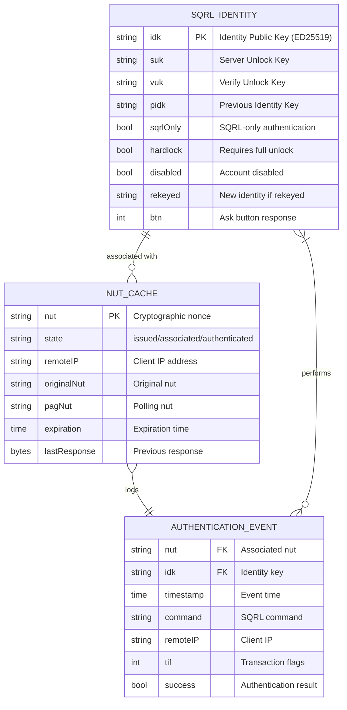

### Data Flow Diagram

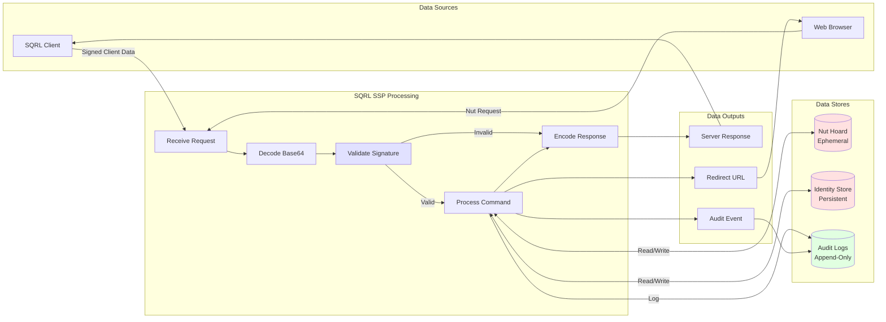

---

## TOGAF Technology Architecture

### Technology Component Model

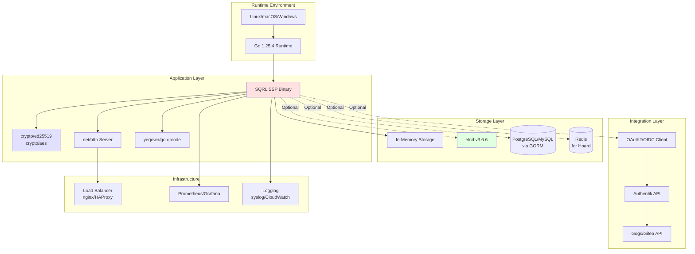

### Deployment Architecture (Current State)

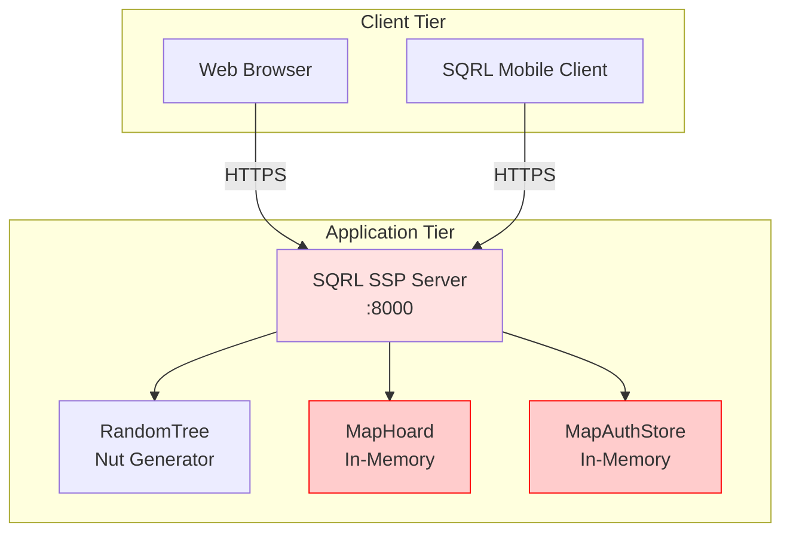

*Note: Red indicates NOT suitable for production (in-memory only)*

### Deployment Architecture (Target State with etcd)

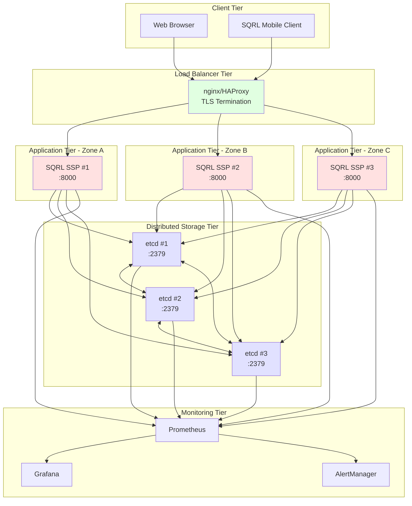

---

## Objectives to Requirements Mapping

### Strategic Alignment

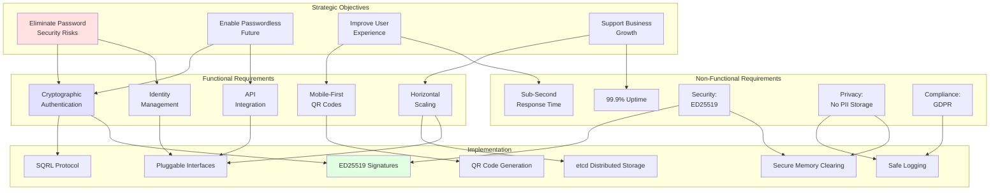

### Requirements Traceability Matrix

| Strategic Objective | Functional Requirement | Non-Functional Requirement | Implementation Component | Status |
|---------------------|------------------------|---------------------------|-------------------------|--------|
| **Eliminate Password Risks** | Cryptographic Authentication | Security: ED25519 | cli_handler.go, cli_request.go | ✅ Complete |
| **Eliminate Password Risks** | Identity Management | Privacy: No PII Storage | api.go, SqrlIdentity | ✅ Complete |
| **Passwordless Future** | API Integration | Extensibility: Interfaces | Authenticator, AuthStore, Hoard | ✅ Complete |
| **Passwordless Future** | OAuth2/OIDC Bridge | Standards Compliance | Stage 4: Authentik Integration | 📋 Planned |
| **Improve User Experience** | Mobile-First QR Codes | Performance: <1s Response | handers.go, QR generation | ✅ Complete |
| **Improve User Experience** | One-Step QR Generation | Usability Enhancement | /png.sqrl extension | ✅ Complete |
| **Support Business Growth** | Horizontal Scaling | Availability: 99.9% Uptime | Stage 3: etcd Integration | 📋 Planned |
| **Support Business Growth** | Multi-Datacenter Deployment | Reliability: Auto-failover | etcd cluster (3-5 nodes) | 📋 Planned |
| **Maintain Security** | Secure Memory Clearing | Security: CWE-226 | secure_clear.go | ✅ Complete |
| **Maintain Security** | Safe Logging | Security: CWE-200, CWE-532 | secure_log.go | ✅ Complete |
| **Compliance** | Audit Logging | Compliance: GDPR | Future: audit_log.go | ❌ Not Started |
| **Compliance** | Data Retention Policies | Compliance: Data Minimization | Future: retention policies | ❌ Not Started |

**Legend:**
- ✅ Complete
- 📋 Planned (in upgrade plan)
- ❌ Not Started
- ⚠️ In Progress

---

## Integration Architecture

### Integration Points

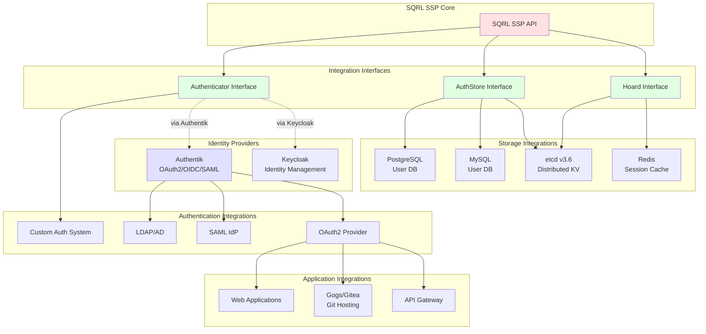

---

## Security Architecture

### Security Zones

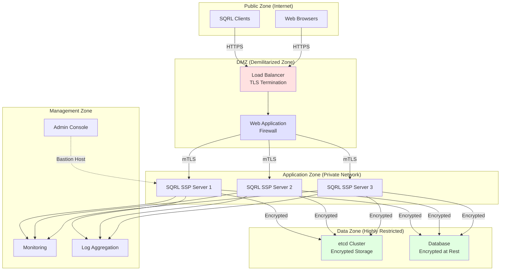

### Security Controls

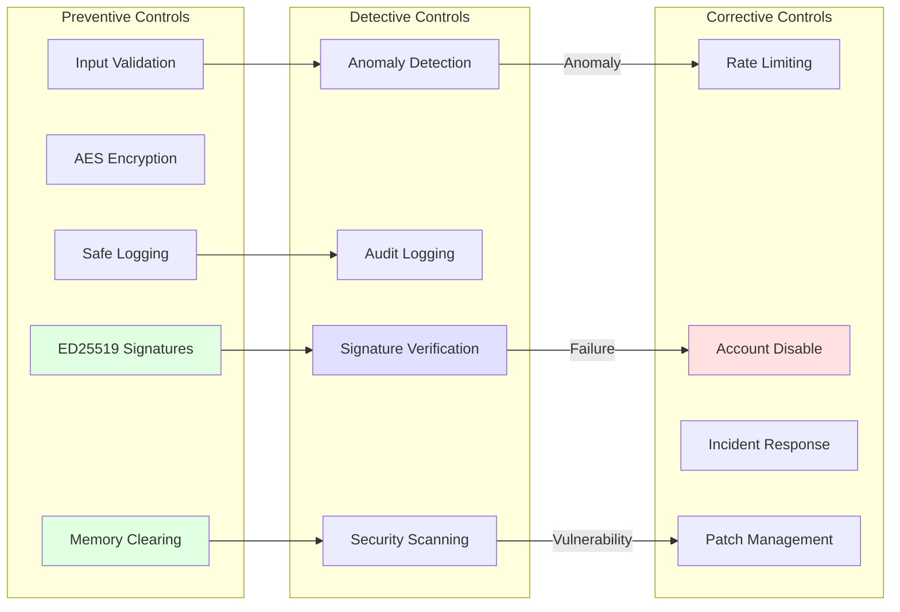

---

## Migration Architecture (Upgrade Path)

### Staged Migration

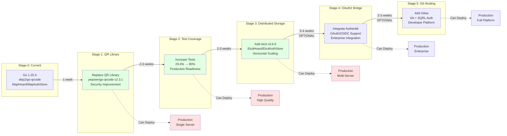

---

## Performance Architecture

### Performance Requirements

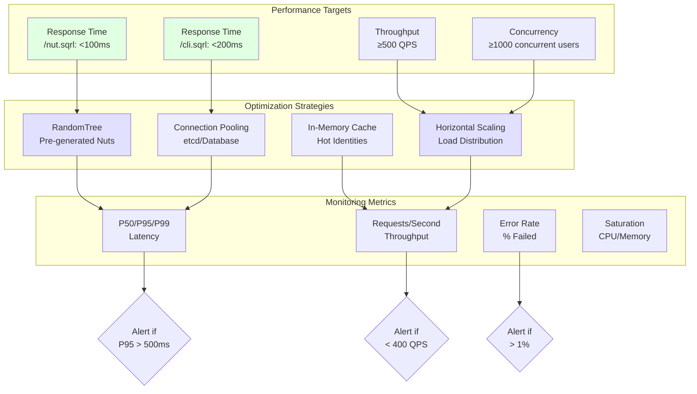

---

## Conclusion

This TOGAF-aligned architecture documentation provides a comprehensive view of the SQRL SSP implementation, mapping business objectives through functional requirements to technical implementation. The architecture supports:

1. **Scalability:** Horizontal scaling via etcd (Stage 3)
2. **Security:** ED25519 cryptography, secure memory, safe logging
3. **Extensibility:** Pluggable interfaces for integration
4. **Maintainability:** Clear separation of concerns, well-tested
5. **Compliance:** Privacy-preserving, audit-capable

The staged upgrade plan (DEPENDENCY_UPGRADE_PLAN.md) provides a safe path to enhance the architecture incrementally, allowing production deployment at multiple checkpoints.

---

**Document Version:** 1.0
**TOGAF Version:** 9.2
**Last Updated:** November 18, 2025
**Status:** Published
